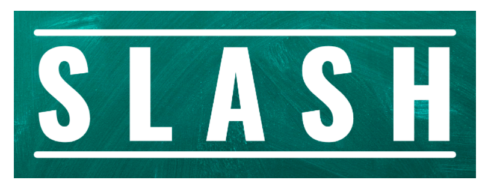

[CSC 510 - Project 3 - Repo Presentation](https://ncsu.zoom.us/rec/share/LX3fKUKuKso1_XNpdK2TvEdADZzpYdMughe_9e_f3-zdzuYhFoxz8k6mHf_vcJOj.QlqORp3KuCJi_boa?startTime=1638480222000)

<p align="center"></p>

[](https://github.com/TommasU/slash/blob/main/LICENSE)
[](https://doi.org/10.5281/zenodo.5739350)

[](https://github.com/TommasU/slash/issues)
[](https://github.com/TommasU/slash/issues?q=is%3Aissue+is%3Aclosed)
[](https://github.com/TommasU/slash/pulls?q=is%3Apr+is%3Aclosed)
[](https://codecov.io/gh/TommasU/slash)
[](https://github.com/SaikrishnaRajaraman/slash/actions/workflows/pylint.yml)
[](https://github.com/TommasU/slash/actions/workflows/style_checker.yml)
[](https://github.com/SaikrishnaRajaraman/slash/actions/workflows/python-package.yml)

Slash is a tool that scrapes the most popular e-commerce websites to get the best deals on searched items across these websites. 
- **Fast**: With slash, you can save over 50% of your time by comparing deals across websites within seconds
- **Easy**: Slash uses very easy commands to filter, sort and search your items
- **Powerful**: Quickly alter the commands to get desired results
<p align="center">
Checkout our newest Features! Mini Version and Full version now showcasing new sets of improvements.


# :rocket: Installation

1. Access the Github repository from your computer. 
 - First, pre-install [git](https://git-scm.com/) on  your machine. 
 - Then, clone the following repo:
 ```
 https://github.com/TommasU/slash.git
 ```
 * Finally, ```cd``` into the local repository.
```
cd slash
```
2. Install the ```requirements.txt```. 
- This project uses Python 3, so make sure that [Python](https://www.python.org/downloads/) and [Pip](https://pip.pypa.io/en/stable/installation/) are preinstalled.
- Install the ```requirements.txt``` file using pip.
```
pip3 install -r requirements.txt
```
3. Running the program

- Use the python command to run the ```slash.py``` file.
```
python3 -m src.slash --search socks
```
<p>


# :dizzy: What's New in Phase 3


## :computer: User Friendly UI


Now featuring a friendly user interface for the Mini Version of SLASH including the best of a search bar and easy to read results. Interface provides options to 
- Sort results
- Change currency displayed
- Filter number of items displayed
- Prices
- Product link
- Timestamps for up to date results
- Ratings
<p align="center"></p>


### :key: Accesing Mini Version UI


1. After completing the <a href="#rocket-installation">Installation</a> and all project dependencies are installed. 

2. Make sure you are in the base directory. 
3. Use the ```flask run``` command.
```
MAC
export FLASK_APP=./src/modules/app
flask run

Windows
set FLASK_APP=.\src\modules\app 
flask run
```
4. Once flask is running, open your internet browser and type ```http://127.0.0.1:5000/``` into the search bar.


### :money_with_wings: UI Features


1. SORTING: Based on rating or price.
2. CURRENCY: View prices in the currency of your choice.
3. RESULTS: Narrow your search based on Result Length.

<p align="center"></p>

<p align="center">
Easy to view and access results
<p align="center"></p>

## :gift: 2 New Attributes!

We have expanded the command line attributes to include:
- `no of ratings`: Having just the ratings does not provide a buyer the complete picture, but with number of ratings, users can obtain a holistic view
- `trending`: This mentions any special tags associated with the item such as "FREE shipping" and "Bestseller".

## :robot: Increased Code Coverage
We have increased the code coverage from `11%` to `70%`!

## :computer: Advanced Wishlists


Now featuring advanced wishlists in the Full Version of SLASH. For the best shopping experience now you can add, edit and delete wishlists with simple commands and flexiblity. Wishlist features include
- Adding new lists with custom names
- Display all available wishlists
- Add items to different wishlist during a search session

### :key: Accesing the Full Version SLASH

1. After completing the <a href="#rocket-installation">Installation</a> and all project dependencies are installed. 

2. Make sure you ```cd``` into the ```src``` folder. 
3. Use the ```slash.py --full T``` command.
```
python3 -m src.slash --full T
```

### :money_with_wings: Wishlist Features

<p align="center"></p>


## :computer: More websites, More results, More shopping

Now featuring results from Amazon, Walmart, Etsy, Google, and Bjs Wholesale.

# :golf: The Basics, Flags and Args 


## Full Version Main Menu 
```--full``` command is used to display the complete menu for the project. If the argument passed is "T", the Full version of the app will be displayed. If the argument passed is "F", the mini version of the app is displayed.

Example:

### When argument "F" is passed : 
```
python3 -m src.slash --search "socks" --full "F"
```
```
              timestamp                                    title       price                                     link  website rating no of ratings       trending
0   30/11/2021 20:56:48  Amazon Brand - Core 10 Women's 6-Pac...      $16.80  www.amazon.com/gp/slredirect/picasso...   amazon    4.6           436
1   30/11/2021 20:56:48  Warm Socks, Taotique 5 Pairs Women W...      $15.99  www.amazon.com/gp/slredirect/picasso...   amazon    4.5            99
2   30/11/2021 20:56:48  CelerSport Ankle Athletic Running So...      $14.95  www.amazon.com/gp/slredirect/picasso...   amazon    4.8         28562
3   30/11/2021 20:56:50  Hanes Women's Cool Comfort No Show S...       $7.00  www.walmart.com/ip/Hanes-Women-s-Coo...  walmart    4.4           314  Reduced price
4   30/11/2021 20:56:50  MUK LUKS Women's Thermal Slipper Soc...      $10.00  www.walmart.com/ip/MUK-LUKS-Women-s-...  walmart    5.0             1  Reduced price

```

### When argument "T" is passed :
```
python3 -m src.slash --search "socks" --full "T"
```
- The output window asks for user information in order to store the data in the database. 
- The user can select to search for product 
- Check the wishlists
- See the currency conversion.

```
Welcome to Slash!
Please enter the following information:
Name: UserName
Email: person@email.com
Welcome  user1
Select from following:    
1. Search new product     
2. Manage Wishlists       
3. See Currency Conversion
4. Exit
```
If the user inputs 1 the command ```--search``` will be used. The product which the user wishes to search for needs to be entered. 


```
1
Enter name of product to Search: socks
```

```
               timestamp                                    title        price                                     link  website  rating  no of ratings           trending
5    30/11/2021 20:59:23  Men's Dri-tech Moisture Control Crew...       $12.99  www.amazon.com/Dickies-Multi-Pack-Dr...   amazon     4.7       136896.0        Best Seller
7    30/11/2021 20:59:23  Women's Performance Heel Tab Athleti...       $12.29  www.amazon.com/Saucony-Womens-Perfor...   amazon     4.8        67199.0        Best Seller
8    30/11/2021 20:59:23  Men's Multi-pack Mesh Ventilating Co...        $9.04  www.amazon.com/Saucony-Multi-Pack-Ve...   amazon     4.6          635.0  Limited time deal
9    30/11/2021 20:59:23  10 Pairs Ankle Socks No Show Sock Lo...       $11.95  www.amazon.com/Pairs-Ankle-Low-Cut-A...   amazon     4.3         4935.0            Save 8%
11   30/11/2021 20:59:23  Men's Essential Lite No Show Socks, ...       $20.00  www.amazon.com/Under-Armour-Essentia...   amazon     4.7         6268.0        Best Seller
15   30/11/2021 20:59:23  Men's Dri-tech Moisture Control Quar...        $9.98  www.amazon.com/Dickies-Multi-Pack-Dr...   amazon     4.7        46825.0  Limited time deal
```


Once the product list is displayed, the user is given the option to choose whether to save in the product or if he or she wished to open the browser and check the link.


```
Enter 1 to save product to wishlist
Enter 2 to open link in browser
Else enter any other key to continue
```

Here, as the user entered 1, the product is saved in the list.

```
             timestamp                                  title  price                                     link website rating
4  04/11/2021 12:24:24  Women's 10-Pair Value Pack Crew Socks  $8.79  www.amazon.com/Hanes-Womens-Crew-Whi...  amazon    4.7
```

## Flags and Args
The tool supports the following flags and command line arguments. These flags and arguments can be used to quickly filter and guide the search to get you the best results very quickly.

| Arguments | Type | Default | Description                                                                                  |
|-----------|------|---------|----------------------------------------------------------------------------------------------|
| --search  | str  | None    | The product name to be used as the search query                                              |
| --num     | int  | 3       | Maximum number of products to search                                                         |
| --sort    | str  | re      | Sort results by relevance (re) or by price (pr)                                              |
| --des     | bool | -       | Set boolean flag if results should be sorted in non-increasing order                         |
| --csv     |      | -       | Save results as CSV                                                                          |
| --full    | str  | F       | T for full version of app; F for mini version of app                                         |
| --link    |      |         | Show links in the table                                                                      |
|--currency | str  |         | Display the amount in specified currency(inr, euro, aud, yuan, yen, pound)                   |

## 1. Searching
```--search```  accepts one argument string which it uses to search and scrape the requested products on 
the e-commerce websites. So, to use this, run the python script followed by the --search argument and the 
search string. The search string should be in double quotes if it have two or more words. Example:
```
python3 -m src.slash --search "socks"
```
```
            timestamp                                    title        price                                     link  website  rating  no of ratings            trending
0    30/11/2021 15:20:42  Bedsure Sherpa Fleece Throw Blanket ...       $21.24  www.amazon.com/gp/slredirect/picasso...   amazon     4.7        55165.0         Best Seller  
2    30/11/2021 15:20:42  Quility Weighted Blanket with Soft C...       $79.99  www.amazon.com/gp/slredirect/picasso...   amazon     4.7        39501.0         Best Seller  
4    30/11/2021 15:20:42  Eddie Bauer Home Plush Sherpa Fleece...       $21.59  www.amazon.com/Eddie-Bauer-Cabin-Fla...   amazon     4.7         6985.0  Holiday Gift Guide  

```

## 2. Sorting
```--sort``` accepts one or more arguments that determine how the tool sorts and filters the requested products
after scraping. The first value is used to initially sort and filter the results of the scraping. The arguments
following the first one are not required but will be used to further sort the filtered results. 

### Sorting by Rating 
```--sort``` accepts the argument "ra" that determine how the tool sorts and filters the requested products
after scraping on the basis of ratings of the product . 
Example:
```
python3 -m src.slash.py --search "socks" --sort ra
```
```
              timestamp                                    title       price                                     link  website  rating no of ratings       trending
4   30/11/2021 20:29:06  MUK LUKS Women's Thermal Slipper Soc...      $10.00  www.walmart.com/ip/MUK-LUKS-Women-s-...  walmart     5.0             1  Reduced price
6   30/11/2021 20:29:07  Follkee Women's Alpaca Wool Socks Pe...      $18.49  www.Etsy.comhttps://www.etsy.com/lis...     Etsy     5.0           740  FREE shipping
7   30/11/2021 20:29:07  Alpaca Socks | GoWith 2 Pairs Cozy W...      $19.99  www.Etsy.comhttps://www.etsy.com/lis...     Etsy     5.0           420  FREE shipping
8   30/11/2021 20:29:07  Daisy Socks | Colourful Cute Floral ...      $21.29  www.Etsy.comhttps://www.etsy.com/lis...     Etsy     5.0           101  FREE shipping
```
### Sorting by Order
The ```--des``` flag can be set to sort the requested products in a non-increasing order. This flag will be 
actually used when coupled with ```--sort```. Example:
```
python3 -m src.slash --search "socks" --sort pr --des
```
```
              timestamp                                    title       price                                     link  website rating no of ratings       trending
11  30/11/2021 20:31:49            Nike Trail Running Crew Socks      $30.00  www.google.com/shopping/product/9126...   google    5.0
13  30/11/2021 20:31:50     Dr. Seuss's Beginner Book Collection      $29.99  www.bjs.com/product/dr-seusss-beginn...      bjs
12  30/11/2021 20:31:50           Toy Time Plush Dog Hand Puppet      $21.99  www.bjs.com/product/toy-time-plush-d...      bjs
8   30/11/2021 20:31:46  Alpaca Socks | GoWith 2 Pairs Cozy W...      $19.99  www.Etsy.comhttps://www.etsy.com/lis...     Etsy    5.0           420  FREE shipping
6   30/11/2021 20:31:46  Follkee Women's Alpaca Wool Socks Pe...      $18.49  www.Etsy.comhttps://www.etsy.com/lis...     Etsy    5.0           740  FREE shipping 
```

## 3. Filtering Result Length
The maximum number of results that are scraped from each website can be set using the ```--num``` argument. It accepts
an integer value ```n``` and then returns ```n``` results from each website. Note that tool returns a maximum of 
the value of ```n``` and the number of results on the webiste. By default this value is set to 3. Example:
```
For Mac
python3 -m src.slash --search "socks" --num 5
```
```
              timestamp                                    title       price                                     link  website rating no of ratings       trending
0   30/11/2021 20:32:40  Amazon Brand - Core 10 Women's 6-Pac...      $16.80  www.amazon.com/gp/slredirect/picasso...   amazon    4.6           436
1   30/11/2021 20:32:41  Warm Socks, Taotique 5 Pairs Women W...      $15.99  www.amazon.com/gp/slredirect/picasso...   amazon    4.5            99
2   30/11/2021 20:32:41  CelerSport Ankle Athletic Running So...      $14.95  www.amazon.com/gp/slredirect/picasso...   amazon    4.8         28562
3   30/11/2021 20:32:41  Custom Face Socks Personalized Funny...      $11.49  www.amazon.com/gp/slredirect/picasso...   amazon
4   30/11/2021 20:32:41  mens Athletic Cushioned Crew Socks (...      $15.00  www.amazon.com/adidas-Athletic-Cushi...   amazon    4.7         16811

```

## 4. Currency Conversion
```--currency``` provides nasic currency conversion for different currencies like INR, EURO, AUD, YUAN, YEN and POUND.

Example:
```
python3 -m src.slash --search "socks" --currency "inr"
```


## 5. Save products in csv
```--csv``` command is used to save the complete list of the searched product in a csv format.
```--cd``` command here is used to change the directory for the csv file.
Example:
```
python3 -m src.slash--search "socks" --csv --cd C:\Anant\NCSU\slash_test_csv
```
```
CSV Saved at:  C:\Anant\NCSU\slash_test_csv
File Name: C:\Anant\NCSU\slash_test_csv\socks211104_1223.csv
```


# :muscle: What's next for future development?

- Creating ordering and payment functionality for customers to directly order from command line
- Create an advanced user interface for full version of the program.
- Provide parameters like in-store availability
- Increase the number of filters. Filter by price range and rating range. 


:thought_balloon: Use Case
---
* ***Students***: Students coming to university are generally on a budget and time constraint and generally spend hours wasting time to search for products on Websites. Slash is the perfect tool for these students that slashes all the unnecessary details on a website and helps them get prices for a product across multiple websites.Make the most of this tool in the upcoming Black Friday Sale.
* ***Data Analysts***: Finding data for any project is one of the most tedious job for a data analyst, and the datasets found might not be the most recent one. Using slash, they can create their own dataset in real time and format it as per their needs so that they can focus on what is actually inportant.

:page_facing_up: Why
---
- In a market where we are spoilt for choices, we often look for the best deals.  
- The ubiquity of internet access has leveled the retail playing field, making it easy for individuals and businesses to sell products without geographic limitation. In 2020, U.S. e-commerce sales, receiving a boost due to the COVID-19 pandemic, grew 44% and represented more than 21% of total retail sales, according to e-commerce information source Internet Retailer.
- The growth of e-commerce has not only changed the way customers shop, but also their expectations of how brands approach customer service, personalize communications, and provide customers choices.
- E-commerce market has prompted cut throat competition amongst dealers, which is discernable through the price patterns for products of major market players. Price cuts are somewhat of a norm now and getting the best deal for your money can sometimes be a hassle (even while online shopping).
- This is what Slash aims to reduce by giving you an easy to use, all in one place solution for finding the best deals for your products that major market dealers have to offer!
- Slash in its current form is for people who have some understanding of python and are comfortable in using the command line interface to interact with systems.
- Future updates aim to encompass a wide variety of users irrespective of their computer knowledge and background.


# :dizzy: What's New in Phase 4

# Slash - Your Ultimate Shopping Companion

## Overview

Slash is a versatile mobile app for Android and a corresponding website that redefines your online shopping experience. With a focus on convenience and savings, Slash allows users to find the best deals on their favorite items across popular e-commerce websites. This project combines the power of Flask,Firebase, HTML, CSS, Bootstrap, and Kotlin in Android Studio to create a seamless shopping platform.

## Features

### User Authentication

- Users can sign up for the website or app by providing their email address and setting a secure password.
- Returning users can easily sign in by entering their previously registered credentials.
- All form fields are subject to validation, ensuring data accuracy and security.
- User information entered during the sign-up process is securely stored and managed using Firebase.

### Web & Mobile App

- Slash offers both a mobile app for Android and a website, providing a consistent shopping experience across platforms.

### Real-Time Web Scraping

- Slash revolutionizes the way you shop by scraping data from popular e-commerce websites in real time.
- Our multi-threading approach enables parallel queries to all these websites, ensuring fast and up-to-date search results.

### Search Results

- The search results are displayed neatly on the results page.
- Each item includes an image, the originating website, its price, and the average user rating.
- Users can conveniently add items to their wishlist for future reference.

### Sorting & Filtering

- Users can sort the displayed items by price and rating, both from high to low and vice versa.
- A currency filter allows users to view prices in their preferred currency, whether it's INR, POUND, EURO, or others.
- A filter option lets users narrow down the list to view only limited items from the entire selection.


### Wishlist Management

- Users can maintain a wishlist of their favorite items, easily accessible through the "Wishlist" button.

## Usage

1. Sign up with your email and password to get started.
2. Conduct searches for your desired items and enjoy real-time results.
3. Add items to your wishlist with a single click.
4. Use the various sorting and filtering options to tailor your search results.
5. Access your wishlist at any time to keep track of your favorite items.

Slash is all about simplicity, convenience, and savings. Discover the best deals effortlessly and revolutionize your online shopping journey today!

## Screenshots

### Website: 


### Mobile App:


## Technologies Used

- Flask
- HTML
- CSS
- Bootstrap
- Kotlin (Android Studio)
- Firebase

# Slash - Quick Start Guide

1. **Getting Started**
   - If you're a new user, start by signing up for Slash using your email and a secure password.
   - Returning users can simply sign in by entering their previously registered email and password.

2. **Comprehensive Search Results**
   - You can search an item you are looking for in the search bar provided and a wide range of products are listed.
   - Each item includes essential details: an image, the originating website, price, and user rating for ease of understanding.

3. **Customize Your Search**
   - Sort your results by price or rating, whether you prefer high-to-low or vice versa.
   - Our currency filter allows you to view prices in your preferred currency, be it INR, POUND, EURO, or more.
   - Utilize our filtering options to focus on limited items within the extensive selection.

4. **Keep Track of Favorites**
   - Simply click the "Add to Wishlist" button, and your desired items are saved for future reference.
   - Whenever you want to check your wishlist, simply click the "Wishlist" button.

5. **Seamless Web & Mobile Experience**
   - Slash offers both a mobile app for Android and a website, ensuring you enjoy a consistent shopping experience across platforms.

## All problems encountered while running the flask app

- The python version had to be changed from from 3.10.5 to the python version 3.11.6
- The pip version had to be changed from 21.3.1 to 23.2.1
- We got an error while installing lxml “ERROR: Could not build wheels for lxml, which is required to install pyproject.toml-based projects”
- We got an error stating “Message "note: This error originates from a subprocess, and is likely not a problem with pip" while installing requirements.txt file using pip.
- For running flask we can use the command “python -m flask run” if “flask run” is not working. 

## Case Study: User Experience Feedback for Slash

This case study provides insight into a user's experience while using "Slash," a comprehensive shopping platform that includes a mobile app for Android and a corresponding website. The user, who comes from a non-CS (Computer Science) background, navigated through the platform, engaging in activities such as signing up, logging in, searching for items, applying filters, and managing a wishlist.

**User Experience Highlights**

**1. User Registration and Login**
   - The user was able to successfully sign up for the service using her email and setting a password. She noted that the registration process was straightforward and user-friendly.
   - Logging in as a returning user also posed no challenges, which indicated a smooth sign-in experience.

**2. Item Search and Result Display**
   - The user could easily search for her desired items and found the search results to be well-organized and easy to navigate.
   - The inclusion of essential information for each item, such as images, originating websites, prices, and user ratings, was particularly appreciated.

**3. Filters and Filter Application**
   - The user found that the filters for sorting results by price and rating worked seamlessly. These filters offered clear functionality and met her expectations.
   - The user, however, encountered difficulty understanding the purpose of the "Result Length" filter. She suggested changing the filter's name to improve its clarity and usability.

**4. Filter Application Process**
   - The user provided feedback that applying filters only after clicking the "Filter Search" button was not as intuitive as expected. She proposed a more user-friendly approach to filter application.

**5. User Interface and Product Display**
   - The user praised the user interface (UI) of the product display, finding it easy to understand and navigate. This positive feedback indicates that the design and layout of the app and website effectively cater to user needs.

**6. Wishlist Feature**
   - The user found the wishlist option to be highly useful, facilitating the organization and tracking of her favorite items.

**Conclusion and Recommendations**

The user's experience with the "Slash" platform was generally positive, with successful sign-up, item search, and appreciation for the UI and wishlist features. However, two important user feedback points stand out:

1. **"Result Length" Filter:** To improve user comprehension, it is recommended to rename the "Result Length" filter to something more intuitive, clarifying its purpose.

2. **Filter Application:** The user suggested streamlining the filter application process for enhanced user-friendliness.


## Project Roadmap

The slash app can be modified to include a percentage of discount for each product and the number of people who have rated that product.
The slash app can include recently viewed products by the user.
Best selling badges on the searched product scrapped from the web has been implemented, changes need to be done on UI.
Search by category for each product.
Include more filters for the products. Example: Colour and category filters.
Display, offers and coupons on eligible products.
Allow users to share the link to products on the website. (implemented in the Android App)
Localization to be added to the website. (Implemented in the Android App)


## License

This project is open source and available under the MIT License license.

---


# :sparkles: Contributors

- Jessica Vargas(jrvargas)
- Parth Parikh(pmparikh)
- Radhika Toravi(rtoravi)
- Rushikesh Deodhar(rdeodha)
- Saurabh Nanda(snanda)

# :sparkles: Contributors (Phase-4)

- Chandana Mallu (cmallu)
- Saikrishna Rajaraman (srajara4)
- Siddharth Anand (sanand8)
- Tripurashree Mysore Manjunatha (tmysore)

## :email: Support

For any queries and help, please reach out to us at: slashse2023@gmail.com
